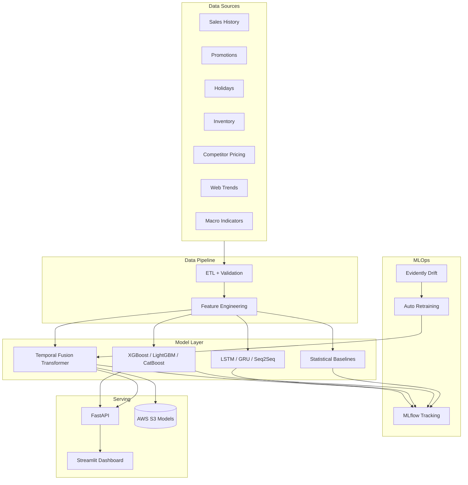
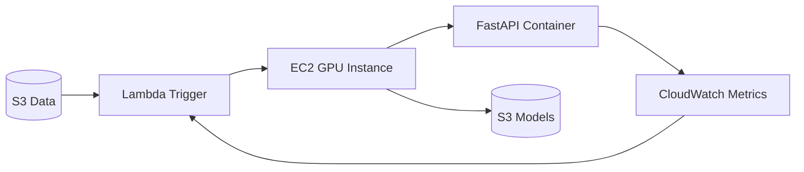

# System Architecture

## High-Level Architecture

## Component Responsibilities

| Component | Technology | Role |
|-----------|------------|------|
| ETL Pipeline | Pandas, scikit-learn | Clean, align, scale time series |
| Feature Store | Custom pipeline | Lags, rolling, Fourier, exogenous |
| TFT Trainer | pytorch-forecasting, Lightning | Multi-horizon quantile forecasts |
| SHAP | shap | ML model explainability |
| API | FastAPI, Pydantic | Production inference |
| Monitoring | Evidently, CloudWatch | Drift + accuracy alerts |
| Registry | MLflow | Experiment + model versioning |

## Deployment Topology (AWS)

