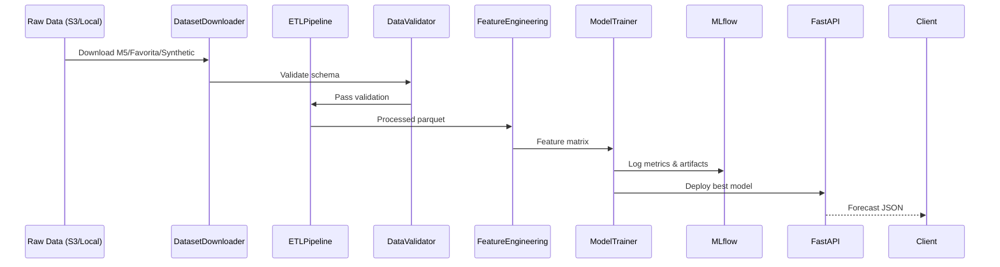

# Data Flow

## Feature Categories (TFT)

| Type | Examples |
|------|----------|
| Static categorical | sku_id, dc_id, category, brand, region |
| Time-varying known | promo_flag, is_holiday, day_of_week |
| Time-varying unknown | demand, inventory_ratio, web_trend |

## Retraining Triggers

1. WMAPE > threshold (default 25%)
2. Evidently data drift detected
3. New data landed in S3 (Lambda event)
